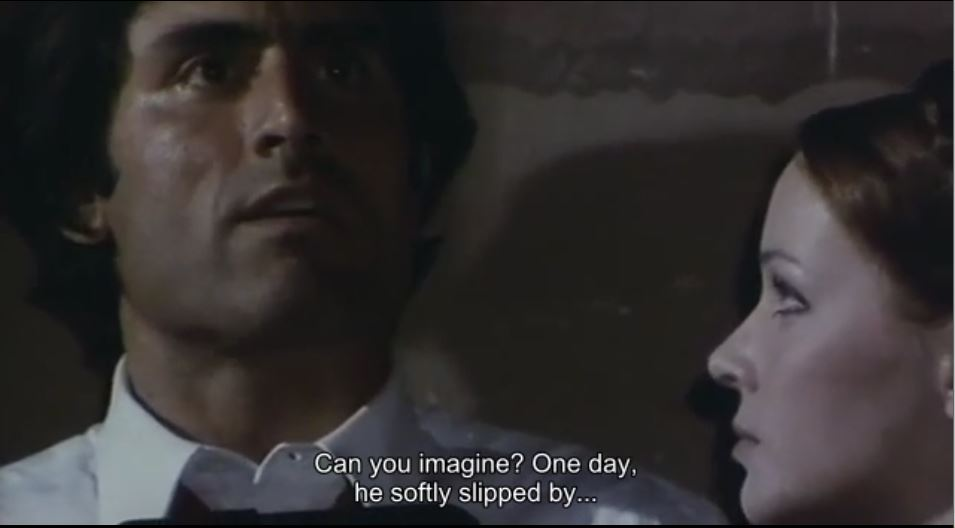

# Create built in subtitles by Ricardo Madela

## Installation

If you have a video file and its subtitle file (with the same name but .srt extension), you can simply run this program and it will create a third video file with the subtitles permanently embedded in the video. I recommend that, if the subtitles are in Latin or with accents, first open the .srt file in Windows Notepad and save the file again, changing the encoding format to 'ANSI'.

You will need to install some simple dependencies such as:

+ glob (pip install glob2)
+ random (pip install random)

The presence of the ffmpeg program and its inclusion in the 'path' will be necessary. I prefer to copy the ffmpeg executable to the windows folder so that it becomes accessible from any folder.

Congratulations! Enjoy~!

## Usage

Simply place the video file and its subtitle in the folder and run the program. You can put multiple files, it will read and convert them all.

If you liked it and want to help me:
BTC address: 32MEWcLH2cLLHJyGUGHpByph18QiTJAzSG

## Instalação

Caso você tenha um arquivo de vídeo e seu arquivo de legendas (com o mesmo nome, mas extensão .srt), você pode simplesmente rodar este programa e ele criará um terceiro arquivo de vídeo com as legendas embutidas permanentemente no vídeo. Recomendo que, caso as legendas sejam em língua latina ou com acentos, abra primeiro o arquivo .srt no notepad do windows e salve novamente o arquivo, alterando o formato da codificação para 'ANSI'.

## Uso

Simplesmente coloque o arquivo de vídeo e sua legenda na pasta e execute o programa. Você pode colocar vários arquivos, ele lerá e converterá todos.

Se gostou e quiser me ajudar:
BTC address: 32MEWcLH2cLLHJyGUGHpByph18QiTJAzSG
